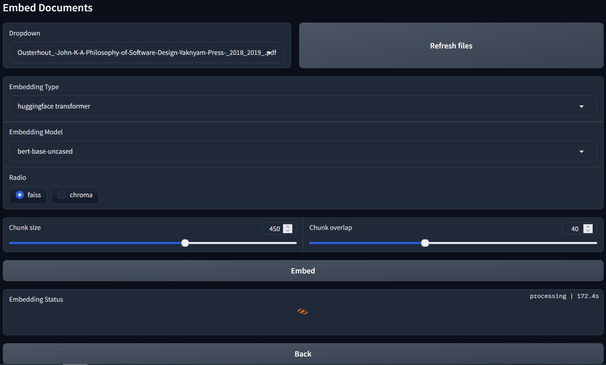
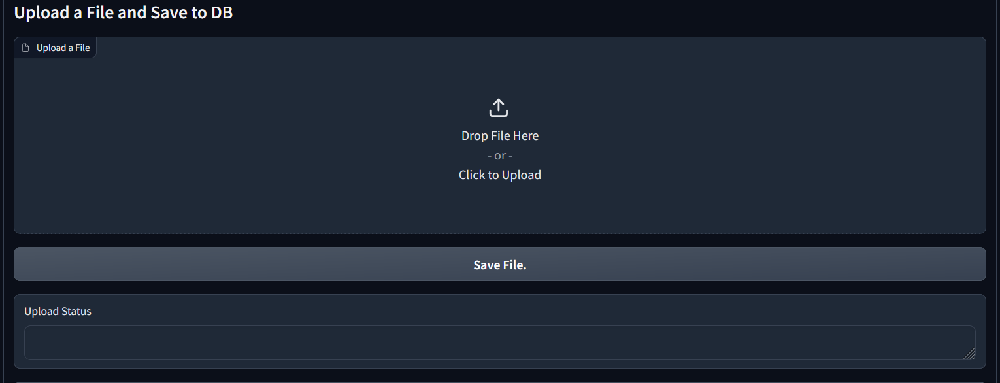

# Rag with Multiple LLMs

### Chat with LLM

<br>

### Emmbed Docuements

<br>

### Uplaod files


This project allows you to chat with multiple AI models using the same PDF document.

## Installation

```bash
git clone https://github.com/PrudhviChakravarthy/rag.git
cd rag
python -m venv env
```

## Activate Environement

### Windows:

```bash
.\env\Scripts\activate
```
### Linux / macOS:

```bash
source env/bin/activate
```
 install required packages
```bash
pip install -r requirements.txt
```

### Run the programm

```bash 
python main.py
```

open any browser and go to :

```bash
http://127.0.0.1:7860/
```


